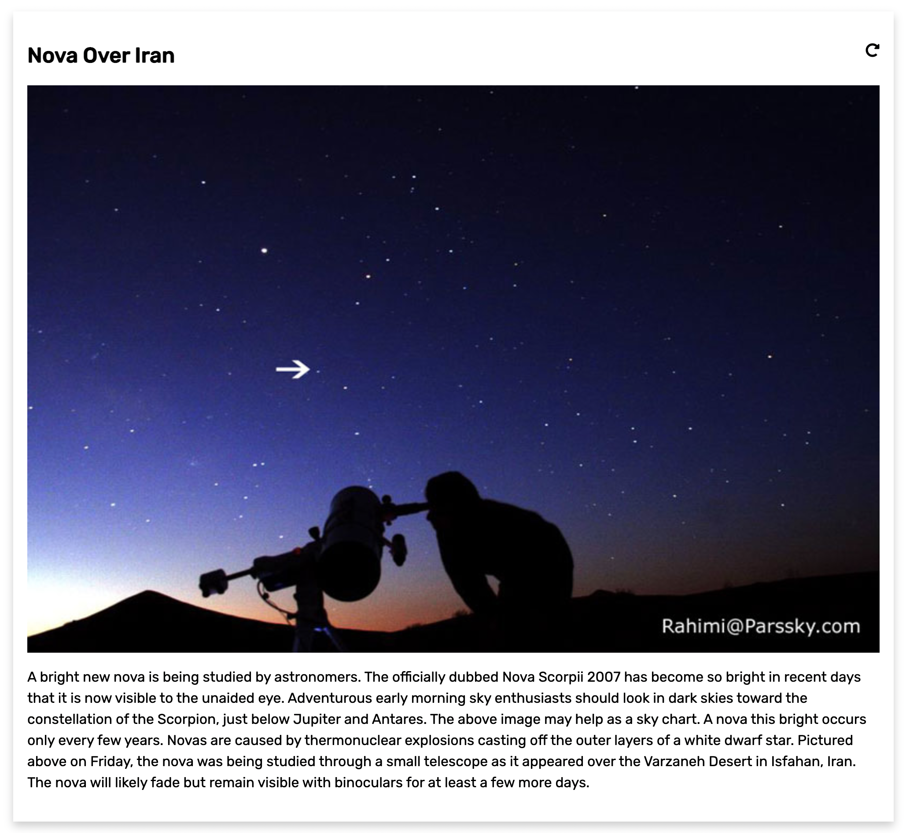

# Application using OPEN NASA API

This application makes use of NASA OPEN API and shows information from Astronomy Image of the day service.

# Live Link

Check the live version here <https://jeevakalaiselvam.github.io/nasa-api-app/>

# Screenshots

